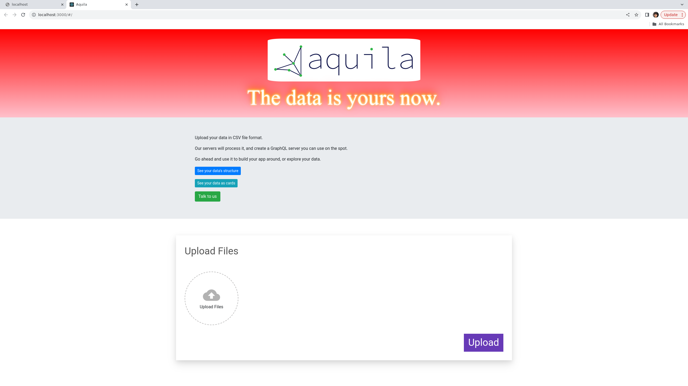

## About

This repo was created for a hackathon.

It lets you upload data, then view it in card format.

It won't run with modern node versions because of the openssl issue but, if you want to run it, you can by entering this into your terminal:

`export NODE_OPTIONS=--openssl-legacy-provider`

Note: not a good security practice in general but this will let the app run if you want to view it locally.

Created with [Create React App](https://github.com/facebook/create-react-app).

## Run The App

First, run  `npm install`.

In the project directory, you can run:

### `npm start`

Open [http://localhost:3000](http://localhost:3000) to view it in the browser.

The page will reload if you make edits. 

